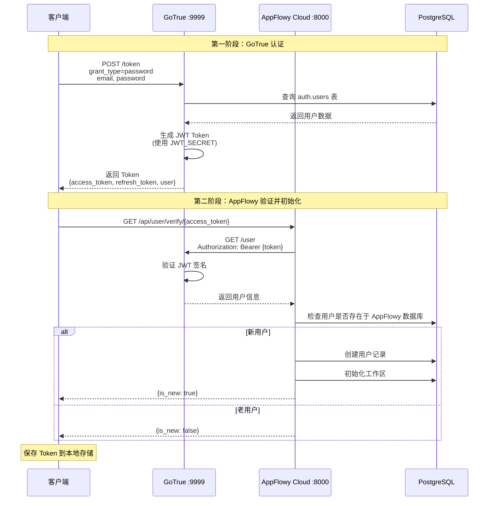
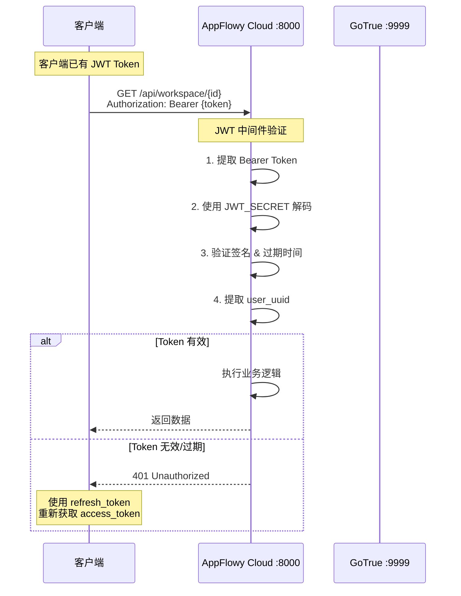
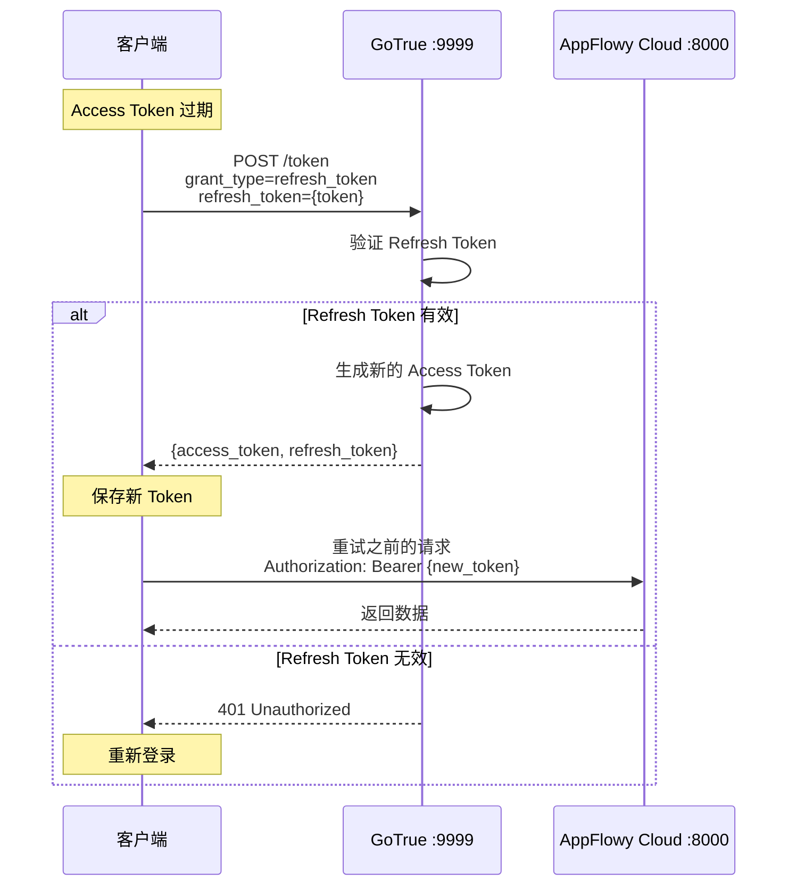

# AppFlowy 认证流程图

## 🎯 核心结论

**AppFlowy 客户端直接连接 GoTrue 进行认证，而不是通过 AppFlowy Cloud 代理。**

---

## 📊 架构图

### 1. 整体架构（客户端直连 GoTrue）

```
                    ┌─────────────────────────┐
                    │   AppFlowy 客户端        │
                    │   (Flutter/Rust)        │
                    └───────────┬─────────────┘
                                │
                    ┌───────────┴──────────────┐
                    │                          │
                    ↓ 认证请求                  ↓ 业务请求
              (直接连接！)                  (携带 JWT Token)
                    │                          │
            ┌───────▼────────┐         ┌───────▼──────────┐
            │   GoTrue       │         │ AppFlowy Cloud   │
            │   :9999        │←────────│    :8000         │
            │                │ 验证Token │                 │
            └───────┬────────┘         └───────┬──────────┘
                    │                          │
                    └──────────┬───────────────┘
                               ↓
                    ┌────────────────────┐
                    │   PostgreSQL       │
                    │   (auth schema +   │
                    │    business data)  │
                    └────────────────────┘

关键点：
1. 客户端有两个独立的 HTTP 客户端：
   - gotrue_client → 直接访问 GoTrue
   - cloud_client → 访问 AppFlowy Cloud
   
2. JWT Secret 共享：
   - GoTrue 用 JWT_SECRET 签发 Token
   - AppFlowy Cloud 用同一个 SECRET 验证 Token
```

---

## 🔄 详细流程

### 流程 1: 用户登录



### 流程 2: 后续 API 调用



### 流程 3: Token 刷新



---

## 🌐 部署模式对比

### 模式 1: 生产环境 (Nginx 反向代理)

```
客户端配置:
  base_url: https://cloud.appflowy.io
  gotrue_url: https://cloud.appflowy.io/gotrue  ← 通过 Nginx
  
┌─────────────┐
│   客户端     │
└──────┬──────┘
       │ HTTPS
       ↓
┌─────────────────────┐
│  Nginx :80/443      │
│  ┌─────────────┐    │
│  │ /gotrue/*   │────┼───→ GoTrue :9999
│  │ /api/*      │────┼───→ AppFlowy :8000
│  │ /ws         │────┼───→ AppFlowy :8000
│  └─────────────┘    │
└─────────────────────┘

Nginx 配置:
location /gotrue/ {
    proxy_pass http://gotrue:9999;
    rewrite ^/gotrue(/.*)$ $1 break;  # 去掉 /gotrue 前缀
}
```

### 模式 2: 开发环境 (直连)

```
客户端配置:
  base_url: http://localhost:8000
  gotrue_url: http://localhost:9999  ← 直连！
  
┌─────────────┐
│   客户端     │
└──────┬──────┘
       │
   ┌───┴────────────┐
   │                │
   ↓                ↓
GoTrue:9999    AppFlowy:8000
   │                │
   └────────┬───────┘
            ↓
      PostgreSQL
      
优点：
- 无需 Nginx
- 调试方便
- 性能更好
```

---

## 🔐 JWT Token 验证机制

### Token 结构

```json
{
  "header": {
    "alg": "HS256",
    "typ": "JWT"
  },
  "payload": {
    "sub": "user-uuid-here",
    "email": "user@example.com",
    "role": "authenticated",
    "session_id": "session-uuid",
    "iat": 1696234567,
    "exp": 1696241767
  },
  "signature": "HMAC-SHA256(base64(header).base64(payload), JWT_SECRET)"
}
```

### 验证流程

```
┌────────────────────────────────────────────────┐
│  JWT Token = header.payload.signature          │
└────────────────┬───────────────────────────────┘
                 │
    ┌────────────▼──────────────┐
    │                           │
    │  GoTrue 签发              │  AppFlowy Cloud 验证
    │  ─────────────            │  ───────────────────
    │  1. 用户登录成功          │  1. 接收客户端请求
    │  2. 生成 payload         │  2. 提取 Bearer Token
    │  3. 使用 JWT_SECRET      │  3. 使用相同的 JWT_SECRET
    │     创建签名:             │     验证签名:
    │                          │
    │     signature =          │     expected = 
    │     HMAC-SHA256(         │     HMAC-SHA256(
    │       header.payload,    │       header.payload,
    │       "hello456"         │       "hello456"
    │     )                    │     )
    │                          │
    │  4. 返回完整 Token        │  4. 比较 signature == expected
    │                          │  5. 检查 exp 是否过期
    │                          │  6. 提取 sub (user_uuid)
    │                          │
    └──────────────────────────┘

关键：GoTrue 和 AppFlowy Cloud 必须使用相同的 JWT_SECRET！

环境变量配置：
  GoTrue:          GOTRUE_JWT_SECRET=hello456
  AppFlowy Cloud:  APPFLOWY_GOTRUE_JWT_SECRET=hello456
```

---

## 📝 关键代码路径

### 客户端侧

```rust
// AppFlowy-Cloud/libs/client-api/src/http.rs

// Client 有两个独立的 HTTP 客户端
pub struct Client {
  pub cloud_client: reqwest::Client,           // → AppFlowy Cloud
  pub(crate) gotrue_client: gotrue::api::Client,  // → GoTrue
  pub token: Arc<RwLock<ClientToken>>,
  // ...
}

// 登录流程
pub async fn sign_in_password(&self, email: &str, password: &str) {
  // 1. 直接调用 GoTrue
  let response = self.gotrue_client
    .token(&Grant::Password(...))
    .await?;
  
  // 2. 验证 Token (调用 AppFlowy Cloud)
  let is_new = self.verify_token_cloud(&response.access_token).await?;
  
  // 3. 保存 Token
  self.token.write().set(response);
}
```

### GoTrue 侧

```go
// PonyNotes-gotrue/internal/api/token.go

func (a *API) Token(w http.ResponseWriter, r *http.Request) error {
  grantType := r.FormValue("grant_type")
  
  switch grantType {
  case "password":
    return a.ResourceOwnerPasswordGrant(w, r)  // 密码登录
  case "refresh_token":
    return a.RefreshTokenGrant(w, r)          // 刷新 Token
  // ...
  }
}

// 生成 JWT Token
func (a *API) issueRefreshToken(user *models.User) (*AccessTokenResponse, error) {
  token := jwt.NewWithClaims(jwt.SigningMethodHS256, claims)
  tokenString, err := token.SignedString([]byte(a.config.JWT.Secret))
  // 返回 Token
}
```

### AppFlowy Cloud 侧

```rust
// AppFlowy-Cloud/src/biz/authentication/jwt.rs

// JWT 中间件
fn get_auth_from_request(req: &HttpRequest) -> Result<Authorization> {
  // 1. 提取 Bearer Token
  let bearer = req.headers().get("Authorization")?;
  let (_, token) = bearer_str.split_once("Bearer ")?;
  
  // 2. 使用 JWT_SECRET 解码验证
  authorization_from_token(token, jwt_secret)
}

fn gotrue_jwt_claims_from_token(token: &str, jwt_secret: &str) {
  // 使用相同的 JWT_SECRET 验证
  let claims = GoTrueJWTClaims::decode(token, jwt_secret.as_bytes())?;
  Ok(claims)
}
```

```rust
// AppFlowy-Cloud/src/biz/user/user_verify.rs

// Token 验证端点
pub async fn verify_token(access_token: &str, state: &AppState) {
  // 调用 GoTrue 验证 Token
  let user = state.gotrue_client.user_info(access_token).await?;
  
  // 检查并创建用户
  let is_new = !is_user_exist(&user_uuid).await?;
  if is_new {
    create_user(...).await?;
    initialize_workspace(...).await?;
  }
  
  Ok(is_new)
}
```

---

## 🔍 调试指南

### 检查客户端配置

```dart
// AppFlowy/frontend/appflowy_flutter/lib/env/cloud_env.dart

// 开发模式
if (authenticatorType == AuthenticatorType.appflowyCloudDevelop) {
  gotrue_url: "$baseUrl:9999"  // ← 直连 GoTrue
}

// 生产模式
else {
  gotrue_url: "$baseURL/gotrue"  // ← 通过 Nginx
}
```

### 验证 JWT Secret 配置

```bash
# 检查 GoTrue
docker exec appflowy-cloud-gotrue-1 env | grep JWT_SECRET
# 输出: GOTRUE_JWT_SECRET=hello456

# 检查 AppFlowy Cloud
docker exec appflowy-cloud-appflowy_cloud-1 env | grep GOTRUE_JWT_SECRET
# 输出: APPFLOWY_GOTRUE_JWT_SECRET=hello456

# 必须一致！
```

### 测试认证流程

```bash
# 1. 测试 GoTrue 健康检查
curl http://localhost:9999/health

# 2. 测试登录
curl -X POST http://localhost:9999/token \
  -H "Content-Type: application/json" \
  -d '{
    "grant_type": "password",
    "email": "test@example.com",
    "password": "password123"
  }'

# 3. 使用返回的 Token 调用 AppFlowy API
curl http://localhost:8000/api/user/workspace_info \
  -H "Authorization: Bearer eyJhbGc..."
```

---

## 📚 总结

### 关键要点

1. **直连架构** ✅
   - 客户端直接连接 GoTrue (不经过 AppFlowy Cloud)
   - 提高性能，减少延迟

2. **Token 共享** ✅
   - GoTrue 签发 JWT Token
   - AppFlowy Cloud 使用相同 JWT_SECRET 验证
   - 实现单点登录

3. **职责分离** ✅
   - GoTrue: 认证、用户管理
   - AppFlowy Cloud: 业务逻辑、工作区管理

4. **部署灵活** ✅
   - 生产：Nginx 统一入口
   - 开发：直连各服务

### 配置检查清单

- [ ] `GOTRUE_JWT_SECRET` == `APPFLOWY_GOTRUE_JWT_SECRET`
- [ ] 客户端 `gotrue_url` 配置正确
- [ ] Nginx 路由配置 `/gotrue/*` (生产环境)
- [ ] PostgreSQL `auth` schema 已创建
- [ ] 防火墙允许 9999 端口 (开发环境)

---

**文档版本**: 1.0  
**创建日期**: 2025-10-02

